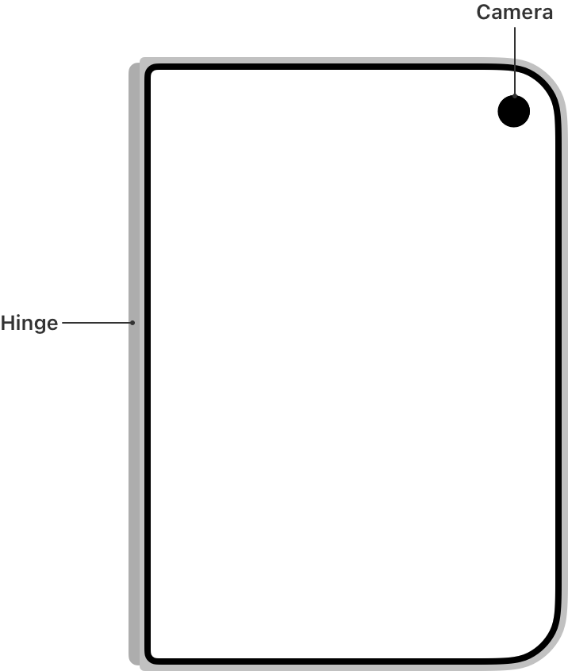
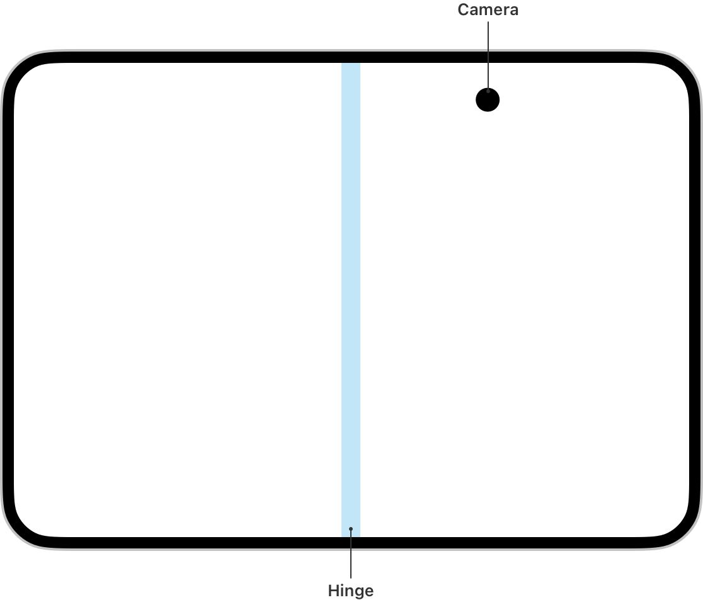
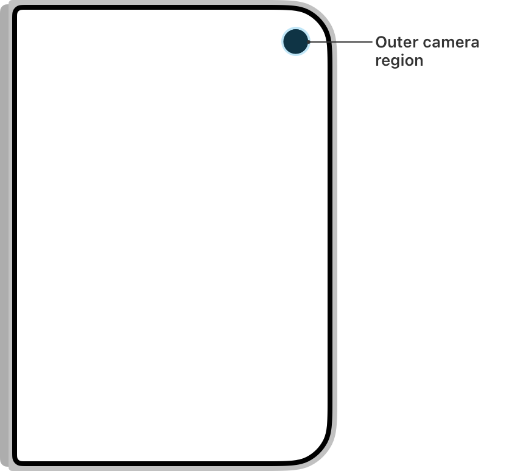
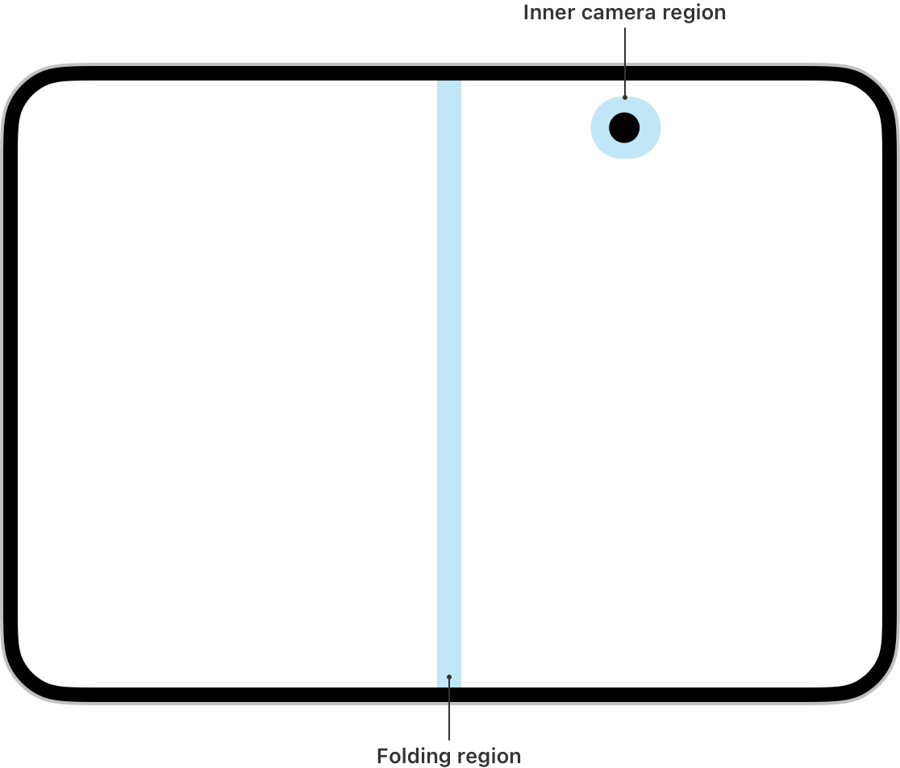
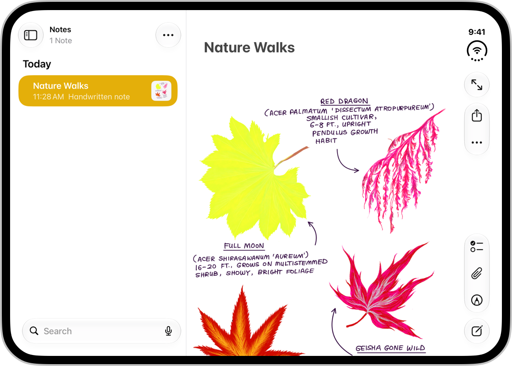
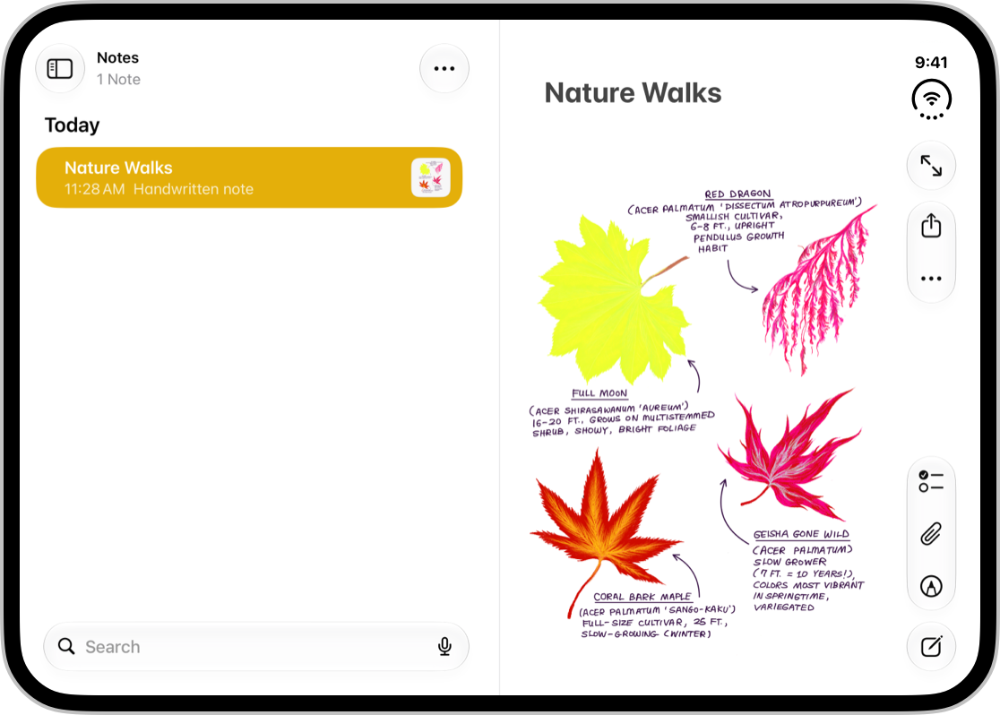
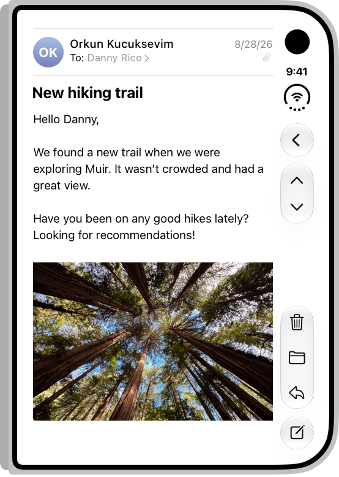
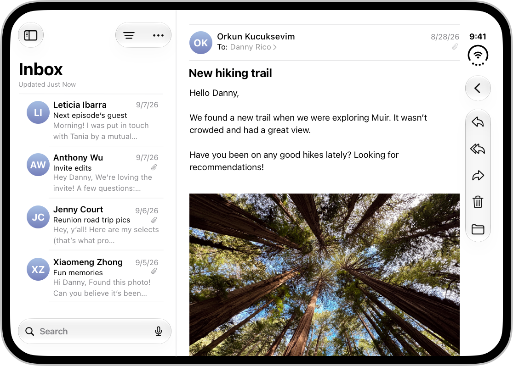
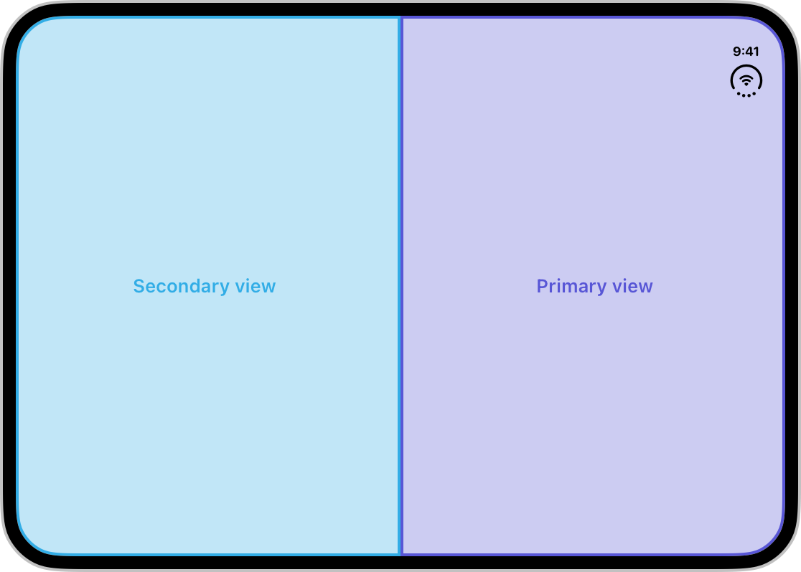
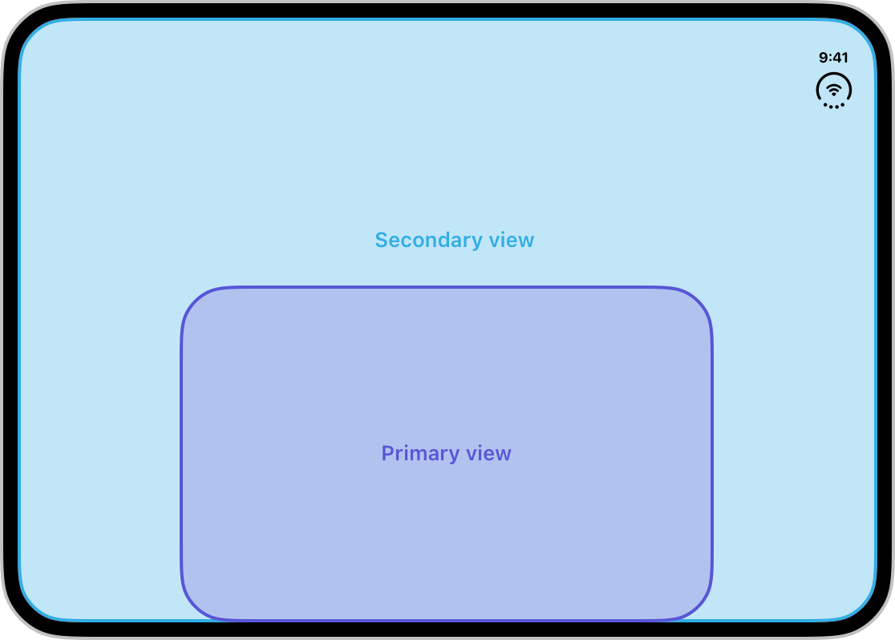

# iPhone Duo layout

iPhone Duo is Apple's first folding iPhone (announced September 2026, iOS 27.1 / Xcode 27.1). It has an **outer display** (used closed; wider and shorter than other iPhones) and an **inner display** (used open; the largest iPhone display, divided by a hinge). Everything on this page comes from Apple's HIG page "Designing for iPhone Duo" and the six September 2026 tech talks; the API names are verified against Apple's own code samples. Don't invent symbols beyond the ones listed here and in `references/` — most of these APIs are newer than any model's training data, so guessing produces plausible-looking code that doesn't compile.

The single most important idea: **you are still designing for iPhone.** Don't build a layout per pose. Build a layout that resizes, and let the system move things.


*Poses: closed, open flat, partially folded like a book, laptop (seated on a table, inner display facing you), tent, standing on its edges. Two size-class layouts cover all of them.*

## 1. Size classes are the whole story

| Display | Orientation | Horizontal | Vertical |
|---|---|---|---|
| Outer (closed) | portrait | compact | regular |
| Outer (closed) | landscape | compact | compact |
| Inner (open) | any | **regular** | **regular** |

So: a compact-width layout for the outer display and a regular-width layout for the inner display are the fundamentals for every pose. That's the same pair you already need for iPhone vs iPad, and for iPhone Mirroring on Mac in iOS 27.

```swift
// SwiftUI
@Environment(\.horizontalSizeClass) private var horizontalSizeClass
@Environment(\.verticalSizeClass) private var verticalSizeClass

// UIKit
traitCollection.horizontalSizeClass
traitCollection.verticalSizeClass
```

Things that look like they'd work but don't:

- **Interface orientation.** The inner display doesn't honor your supported-orientation list, so orientation-based layout decisions silently break there. Use size classes.
- **User-interface idiom.** `.phone` no longer implies "narrow". The inner display is regular/regular on a `.phone` idiom.
- **`UIScreen.main`.** On a two-display device it's ambiguous, and Apple says it will be deprecated. Prefer the environment / trait collection / scene bounds; if you truly need a screen, get it from the scene:

```swift
let screen = window?.windowScene?.screen     // not UIScreen.main
let scale  = traitCollection.displayScale    // not UIScreen.main.scale
```

- **Fixed widths, breakpoints, or metrics tied to a specific display.** Split View multitasking gives your app half the inner display; Picture in Picture pinned to the top shrinks it vertically in real time. Anything hardcoded will be wrong somewhere.
- **`UIRequiresFullScreen`.** Still honored, but the app still resizes when the device opens/closes, and scales on the inner display. It doesn't exempt you from adaptivity.

The device-specific work your app needs beyond this is genuinely small, and it's all about the things below.

## 2. Safe areas are asymmetric



*Outer display: hinge along one edge, outer front camera in the corner — always visible. Inner display: hinge through the center, inner front camera under the display — hidden until active.*

On the outer display, and on the inner display in landscape, toolbars, tab bars, the status bar and the Dynamic Island all move to a **vertical strip along one side** (see the `iphone-duo-toolbars` skill). That strip is expressed to your app as a **leading or trailing safe-area inset** — horizontal bars give top/bottom insets, vertical bars give leading/trailing insets. Which side depends on context: the right edge normally, but the *left* edge for the left-hand app in Split View multitasking. The bar stays on the same physical side in right-to-left languages, too.


*Two apps side by side on the inner display. Each app's controls sit on its outer edge — the left app's vertical bar is on the left.*

Consequences:

- **Foreground / interactive content goes inside the safe area.** SwiftUI does this by default. In UIKit, use Auto Layout against `safeAreaLayoutGuide`, or `view.bounds.inset(by: view.safeAreaInsets)` when laying out manually.
- **Background art may ignore it.** `.ignoresSafeArea()` in SwiftUI; `view.bounds` in UIKit. A full-width header image over inset scrolling content is an explicitly endorsed pattern — just keep every tappable thing inside the inset area.
- **Never mirror one side's inset onto the other.**

```swift
// Wrong — assumes symmetry
let width = view.bounds.width - view.safeAreaInsets.left * 2
// Right — each side independently
let width = view.bounds.inset(by: view.safeAreaInsets).width
```

- **Layout margins are asymmetric too**, so content can get closer to the vertical bar while keeping its margin on the opposite side. Use the system margins rather than your own constants.
- **Centering on the full display is now the exception.** Most content should be offset by the safe area so it isn't behind controls. Full-display centering is right only for immersive, non-scrolling, highly visual UI where you're sure nothing interactive lands under the bar (Calculator does this).
- To match the new screen corners, use the iOS 26 concentricity APIs, which were updated for Duo: `ConcentricRectangle()` in SwiftUI, `UICornerConfiguration` in UIKit.

## 3. Reserved regions: the fold and the cameras



*Reserved regions are areas content avoids or components adapt to — the same idea as window controls on iPad.*

Three regions exist:

| Region | Where | Active when |
|---|---|---|
| Outer front camera | outer display corner | always; expands into the Dynamic Island for Live Activities. The system accounts for it automatically when bars are vertical. |
| Inner front camera | inner display | only while the camera is in use; UI moves aside to reveal it |
| Folding region | inner display center | only when the device is partially folded — it divides the display into two usable regions |

**Most apps never touch the reserved-region API.** Alerts, action sheets, context menus, popovers, sheets, toolbar buttons and `NavigationSplitView` / `UISplitViewController` all avoid the fold automatically (a split view snaps to an even 50/50 when folded, as in Notes below). Use system components wherever you can and you inherit this.



*Notes on the inner display: fully open, the sidebar is narrower than the note; partially folded, the split view adjusts both panes to equal width so neither straddles the fold.*

Reach for the API when you have **custom, manually positioned controls** (your own bars, a floating player, a centered action panel, edge-to-edge UI) that must stay tappable when folded. Full details and the design patterns for *where* to move things are in [references/reserved-regions.md](references/reserved-regions.md). The short version:

```swift
// SwiftUI — from a GeometryReader or onGeometryChange proxy
GeometryReader { proxy in
    let fold   = proxy.reservedRegions(kind: .division)                              // the hinge; active only when folded
    let camera = proxy.reservedRegions(kind: .occlusion)                             // inner camera; active only when in use
    let any    = proxy.reservedRegions(kind: .division, options: .includeInactive)   // for structural decisions
    let frames = fold.map(\.frame)
    // …
}

// UIKit
let regions = view.reservedRegions(kind: .division)
let frames  = regions.map(\.frame)
```

Design rules that go with it:

- **Move only what's necessary.** Small adjustments beat rearrangement; controls that disappear or jump are hard to find. Keep related elements moving together (a photo and its context menu align around the fold together rather than the menu flying to the other region).
- **Scrolling content doesn't displace.** Articles, feeds, lists, documents already adapt by scrolling; nudging them between regions breaks continuity.
- **Grids: prefer an even number of columns** so the fold lands on a gutter. Query with `.includeInactive` so the column count doesn't flip as the user folds — the division region exists (inactive, zero width) even when flat.
- **Where things move depends on pose.** Book: toward the trailing region (closer to where it'll be when closed). Laptop on a table: glanceable content up top, tappable controls on the stable bottom half.

## 4. Two-pane layouts: split views and arrangement views

### Split views (navigation hierarchy)

`NavigationSplitView` / `UISplitViewController` are the first tool for the inner display. They collapse to a single stack when closed and expand to columns when open, and they already adapt to the fold. Mail shows list *or* message when closed, both side by side when open — same hierarchy, one more level visible.




For tab-based apps, the inner display can promote the tab bar to a sidebar (best for information-dense apps like Health, not for every app):

```swift
TabView { … }.defaultTabBarPlacement(.sidebar)          // SwiftUI
tabBarController.sidebar.preferredPlacement = .sidebar   // UIKit
```

### Arrangement views (layout, not navigation) — new in iOS 27.1

An `ArrangementView` holds exactly two views — **primary** and **secondary** — and positions them from size class, aspect ratio, and active division regions. It's for layouts that *look* like a split view but don't need navigation's expand/collapse machinery: a player + up-next list, now-playing + transcript, content + a control panel.




| Style | What it does | Use when | Migrate from |
|---|---|---|---|
| `.split` (default) | Divides the area. Horizontal when wider than tall, vertical when taller than wide. | Main–detail; neither view may be obscured. | `HStack` / `VStack` |
| `.overlay` | Layers primary over secondary. When partially folded, moves them side by side instead. | Foreground/background; background may be partly covered (e.g. scrollable content under controls). | `ZStack` |

```swift
// SwiftUI
NavigationStack {                         // navigation OUTSIDE the arrangement
    ArrangementView {
        PlayerView()                      // primary
    } secondary: {
        UpNextView()                      // secondary
    }
    .arrangementViewStyle(.split.axes(.horizontal))   // or .split, or .overlay
}

// UIKit
let arrangementVC = UIArrangementViewController()
let nav = UINavigationController(rootViewController: arrangementVC)
arrangementVC.setViewController(PlayerViewController(), for: .primary)
arrangementVC.setViewController(UpNextViewController(), for: .secondary)
arrangementVC.updateArrangement(.split.axes(.horizontal))
```

Two hard rules from Apple: **don't put navigation containers inside an arrangement view** (wrap the arrangement in `NavigationStack` / `NavigationSplitView` / `TabView` instead), and **don't put an arrangement view inside a `List` or `ScrollView`.** Axis restriction, the overlay z-index environment, and the choice heuristics are in [references/arrangement-views.md](references/arrangement-views.md).

## 5. The hinge itself

For *layout*, use size classes, reserved regions, and arrangements. The hinge API is for **interactions and effects** — a whammy bar driven by fold angle, a wallpaper zoom, a 3D object that tilts.

```swift
GuitarView(pitchBend: pitchBend)
    .onHingeChange { _, context in                          // (previous, current)
        if let hinge = context.hinge, hinge.status == .partiallyOpen {   // hinge is nil on non-folding devices
            pitchBend = calculatePitchBend(angle: hinge.angle)           // continuous Angle
        } else {
            pitchBend = 0                                                // reset when closed / fully open
        }
    }
```

UIKit's equivalent is `UIHingeInteraction`. Status values are `.closed`, `.partiallyOpen`, `.fullyOpen`. Always handle the `nil` hinge and the non-partially-open branch so state doesn't stick.

## 6. Scenes and multiple displays (brief)

- All apps participate in Split View multitasking on the inner display — no opt-in.
- iPhone Duo is the first iPhone that can run **multiple scenes** of your app. If you support that on iPad you get it here; but new windows can only be created on the **inner** display, so handle scene-request errors and prefer `UIWindowSceneActivationAction`, which hides itself when unavailable.
- Camera apps can show a second UI on the outer display (a teleprompter, a preview for the subject) with `.sceneAccessory { CameraCaptureAccessory(isEnabled:) { … } }` plus `.onAvailabilityChange`. That's a camera-specific topic outside this skill; see the "Leverage multiple displays and scenes on iPhone Duo" and "Build a great camera experience for iPhone Duo" tech talks.

## 7. Games

Lock to portrait or landscape if you must, but fill the screen in every pose. Keep text and control sizes consistent while resizing. Prefer changing the aspect ratio over letterboxing/pillarboxing; if you can't avoid bars, put artwork in the padding so it still feels full-screen.

## Before you finish: self-check the file you touched

The mistakes are mechanical, so check mechanically. Run the scanner from the `iphone-duo-audit` skill on the file(s) you edited (it's a plain bash script, no dependencies):

```bash
bash <path-to-skills>/iphone-duo-audit/scripts/duo_audit.sh <dir-or-file-you-changed>
```

Then confirm by reading: no `UIScreen.main`; no orientation/idiom branches; no literal widths; foreground inside the safe area, and no `inset.left * 2`; navigation containers *outside* any `ArrangementView`; grids with even columns. If a screenshot of the running screen exists, the `iphone-duo-inspect` skill can draw the problems on it.

## Testing

Xcode 27.1 → **Device Hub** → iPhone Duo simulator. The buttons at the bottom open, close, rotate and fold the device. To test Split View, drag the app by its home indicator to one side of the inner display, then try the other side — the vertical bar (and your safe-area asymmetry) flips. Xcode 27.1 also ships Apple's own **App Resizability** skill covering SwiftUI + iPhone Duo; run it alongside this one. If you have a checklist-style review to do rather than new code, use the `iphone-duo-audit` skill.

## References

- [references/reserved-regions.md](references/reserved-regions.md) — full API surface, active/inactive semantics, displacement patterns by pose
- [references/arrangement-views.md](references/arrangement-views.md) — styles, axes, `overlayArrangementZIndex`, choosing split vs overlay, anti-patterns
- HIG: https://developer.apple.com/design/human-interface-guidelines/designing-for-iphone-duo
- Tech talks: *Prepare your app for iPhone Duo* (111461), *Strike a pose with adaptive layouts on iPhone Duo* (111463), *Leverage multiple displays and scenes on iPhone Duo* (111464), *Design for iPhone Duo* (111466)
