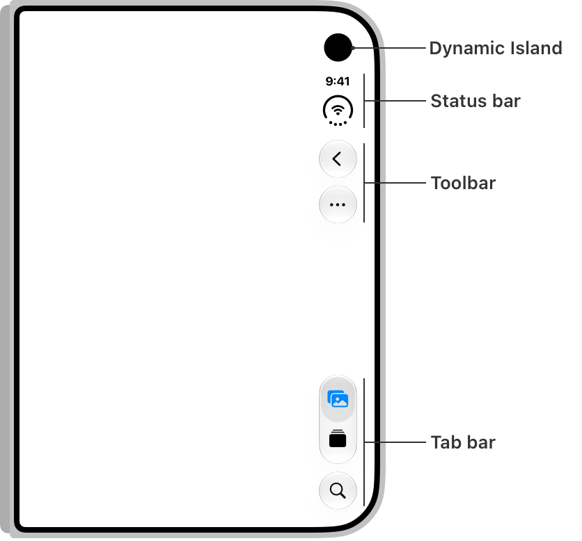
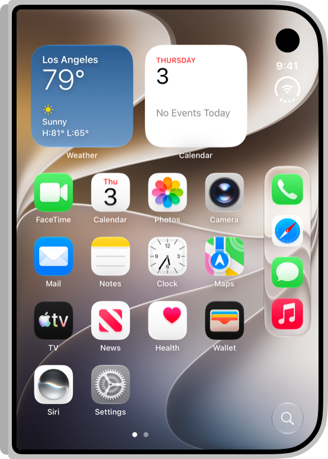
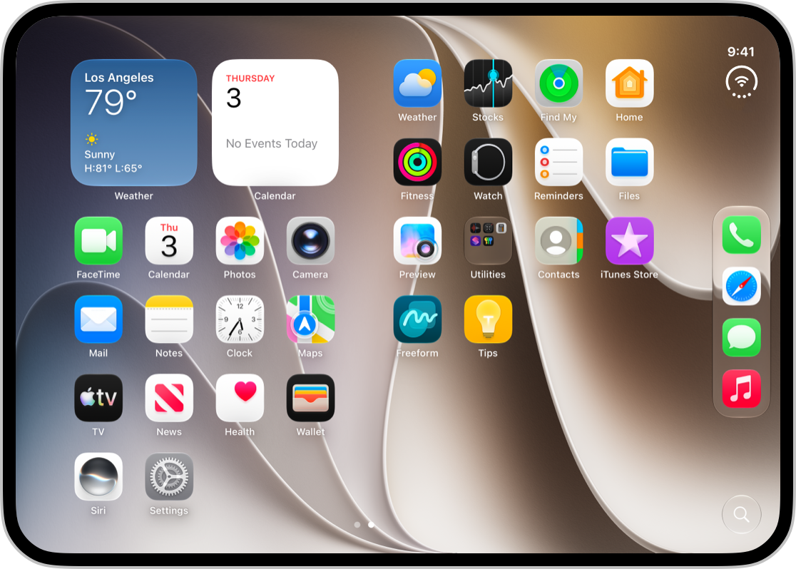
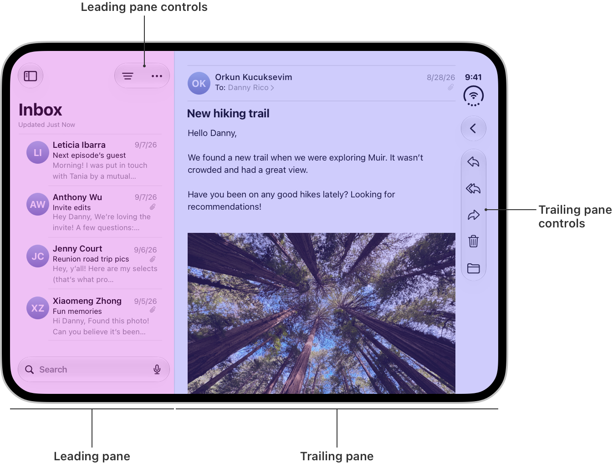
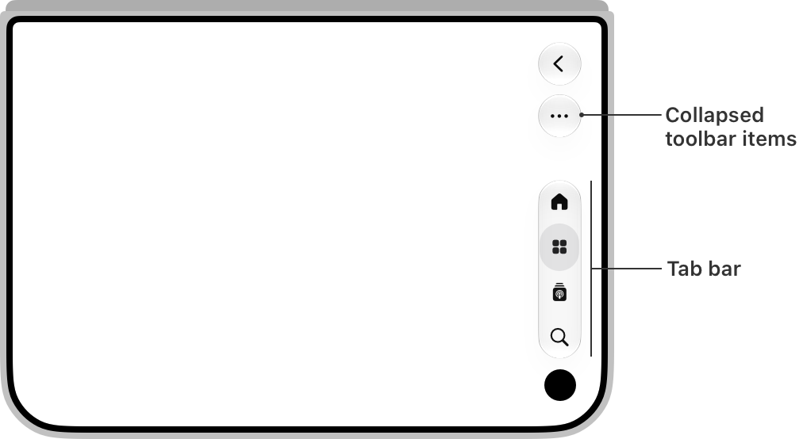
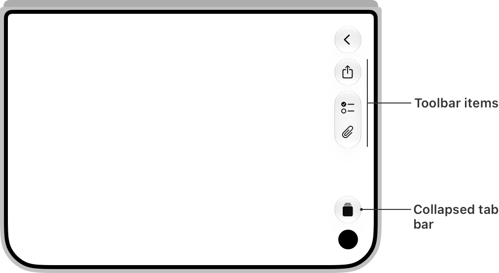
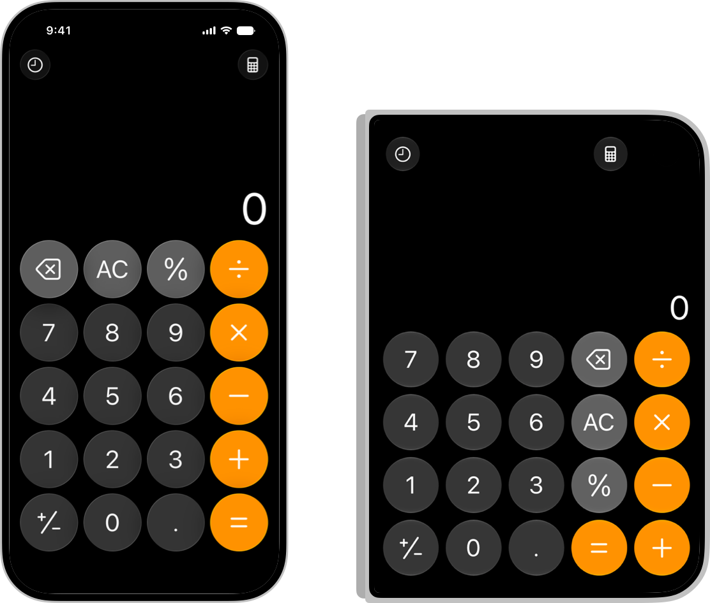

# iPhone Duo toolbars and vertical bars

On iPhone Duo the outer display is wider and shorter than any other iPhone. To preserve vertical space for content — and put controls under the thumb — the system moves **everything that used to be at the top and bottom onto one vertical strip along the side**: the Dynamic Island, the status bar, navigation buttons, the toolbar, and the tab bar. This happens on the **outer display in every orientation** and on the **inner display in landscape**. The inner display in portrait has plenty of height and keeps ordinary horizontal bars.


*Outer display, top to bottom along the trailing edge: Dynamic Island, status bar, toolbar, tab bar.*

 

The bar is aligned to the hardware, not the writing direction: it stays on the same physical side in RTL languages, and in Split View multitasking each app's bar sits on its **outer** edge, so the left-hand app's controls are on the left. That's why safe-area insets are asymmetric and why you must never assume which side is inset (see the `iphone-duo-layout` skill).

Everything below is from the HIG "Designing for iPhone Duo" → *Vertical controls* and the tech talk *Raise the bar with iPhone Duo* (111462); API names are verified against Apple's samples. Requires building with the **iOS 27.1 SDK / Xcode 27.1** — without that, bars stay horizontal and your app doesn't extend to the screen edge.

## 1. Opt in: use the system's bars

The system can only relocate items it manages. Content inside a hand-built `UIToolbar`, `UINavigationBar` or `UITabBar` is **not considered** for the vertical bar.

```swift
// SwiftUI — .toolbar paired with a navigation container
NavigationStack {
    ContentView()
        .toolbar {
            ToolbarItem(placement: .bottomBar) { … }
        }
}
```

```swift
// UIKit — set items on the view controller; let UINavigationController / UITabBarController own the bars
navigationItem.leadingItemGroups = [UIBarButtonItemGroup(…)]
// not:  let toolbar = UIToolbar(); toolbar.items = […]
```

In split views only the **detail column** gets a vertical bar; other columns keep horizontal items; inspectors don't get their own. Sheets on the outer display show their toolbar vertically; on the inner display they're centered with horizontal bars (with `preferredPlacement`, a right-placed sheet gets a vertical bar, a left-placed one doesn't). Keyboard accessory bars never go vertical.

## 2. Order: rotate your bars 90° into one stack

Think of the top bar, bottom toolbar and tab bar rotated into a single column. The system does this for you and keeps a vertical spacer between the top-bar group and the bottom-bar group so they read as distinct. Your job is to make sure the *existing* order is right:

1. **Top of the strip: primary navigation** — Back or Close. A `UINavigationController` back button is added automatically. For custom ones:
   ```swift
   ToolbarItem(placement: .cancellationAction) { … }          // SwiftUI
   navigationItem.leftItemsSupplementBackButton = false        // UIKit (the default) + a leading item
   ```
2. **Then prominent actions** — Done, Save:
   ```swift
   ToolbarItem(placement: .topBarPinnedTrailing) { … }        // SwiftUI (iOS 27)
   navigationItem.pinnedTrailingGroup = UIBarButtonItemGroup(…) // UIKit
   ```
3. **Remaining toolbar items in their original groups.** Top-bar items go to the top of the strip, bottom-bar items to the bottom.
4. **Tab bar stays bottom-aligned.**

Group with `ToolbarItemGroup` / `UIBarButtonItemGroup` and let the system space them. Flexible spacers are **zero-size** in a vertical bar; fixed spacers keep their minimum. Don't add spacing yourself, on either axis.

Not every pose lays bars out vertically, so keep each control's *relative* position the same across poses — people shouldn't relearn where Done is when they open the device.

## 3. Content: symbols go vertical, text stays horizontal

A horizontal bar has fixed height and flexible item width. A vertical bar is the opposite: **fixed width, flexible height**. That makes it suited to symbol-only items. The system decides per item:

| Item content | Where it goes |
|---|---|
| Symbol (with a title you supplied) | vertical bar |
| Text-only (e.g. "Edit") | stays in the horizontal bar |
| Custom view (UIKit `customView`, complex SwiftUI view) | stays horizontal unless you opt it in |
| Wide controls (segmented control, text buttons) | stay in the nav bar |

So the preparation work is:

- **Give every non-text item both a symbol and a title.** `Label("Share", systemImage: "square.and.arrow.up")` in SwiftUI; `title` *and* `image` on `UIBarButtonItem`. The title isn't wasted — it's what appears in the overflow menu and expanded forms.
- **Minimize text-only and text+symbol items** so more can go vertical. Ask: does the text carry standalone information, or just reinforce the symbol? "Inbox 7" → a symbol with a badge. "Cart $42" → the amount is information; keep it horizontal.
  ```swift
  ToolbarItem { InboxButton().badge(7) }     // SwiftUI (iOS 26 badge API)
  item.badge = .count(7)                     // UIKit
  ```
- **Items that swap between a symbol and text** (a custom Select ⇄ Done) must not go vertical, because related items should stay on one axis. The system Edit button already handles this; for your own:
  ```swift
  ToolbarItem { SelectOrDoneButton() }.axisBehavior(.horizontalOnly)   // SwiftUI
  item.axisBehavior = .horizontalOnly                                    // UIKit
  ```
- **Custom views that *do* have a vertical layout** opt in:
  ```swift
  ToolbarItem { CompassView() }.axisBehavior(.verticalPreferred)
  let item = UIBarButtonItem(customView: CompassView()); item.axisBehavior = .verticalPreferred
  ```
  When you opt in, the view must fit the bar's fixed width or provide a vertical variant (Apple's example: an action panel that hides its titles and gets shorter). To know which layout to render, read the edge — it's set when items can be vertical, `nil` / unspecified otherwise:
  ```swift
  @Environment(\.toolbarVerticalEdge) var edge        // SwiftUI; switch on it
  switch traitCollection.verticalBarEdge { … }        // UIKit
  ```
  A vertical bar has no scroll-edge effect but *does* get a background under Reduce Transparency — keep custom content legible either way.

## 4. Keep controls near what they control

Only the container along the display edge participates. If a control belongs to another pane — the leading list in Mail — leave it above that pane rather than pushing it to the side. Proximity is what tells people the control acts on the list, not on the open message.


*Controls for the leading pane sit at the top of that pane; controls for the trailing pane go on the vertical edge.*

## 5. Overflow: decide what survives

The outer display in landscape overflows more often — less height, plus competing UI (keyboard, Picture in Picture pinned at the top in open portrait). Three decisions:

**a. Which bar compresses first.** Default: the *toolbar* collapses into the overflow menu so tab destinations stay reachable (navigation-focused apps like Podcasts). Task-focused screens (Games' editor) prefer the opposite — the tab bar minimizes to a single control so actions stay.

 

```swift
// SwiftUI — per view
TabView {
    Tab("Recents", systemImage: "clock") {
        ContentView().toolbarVerticalCompressionBehavior(.prefersToolbarItems)
    }
}
// UIKit
navigationItem.verticalBarCompressionBehavior = .prefersBarItems
```

**b. One overflow menu.** If your app has its own "more" menu, fold its actions into the system one so everything is in one place. The ellipsis is the overflow symbol on iPhone — reserve it for this and give any other menu a distinct symbol.

```swift
// SwiftUI (iOS 27)
.toolbar {
    ToolbarOverflowMenu {
        Button("Scan") { … }
        Button("Connect") { … }
    }
}
// UIKit
navigationItem.additionalOverflowItems = UIDeferredMenuElement { provider in
    provider(self.persistentOverflowItems())
}
```

**c. Which items overflow last.** Items overflow **bottom to top** by default. Assign priority — first by group, then by item within a group if you need finer control:

```swift
ToolbarItem { Button(…) }.visibilityPriority(.high)     // .high, .low, .automatic, or
                                                        // ToolbarItemVisibilityPriority(higherThan:) / (lowerThan:)
item.visibilityPriority = .high                          // UIKit: .high, .low, .standard, higherThan:/lowerThan:
```

Keep visible longest: frequently used primary actions (Compose in Mail, New Note in Notes) and anything conveying status at a glance (badged items).

## 6. When to turn the vertical bar off

Most apps should keep it — it's a core pattern of the device and consistency across apps is the point. Two legitimate exceptions:

- A single-page, bottom-heavy layout where a horizontal bar lets content fill the width (Calculator uses the full display width; nothing conflicts with the Dynamic Island or status bar).
- A control-heavy sheet with just one button (a lone Close) where the strip would waste space. The sheet then stops short of the camera and the status bar repositions.



```swift
NavigationStack { ContentView().toolbarVerticalBehavior(.disabled) }   // SwiftUI
override var preferredVerticalBarBehavior: UIVerticalBarBehavior { .disabled }   // UIKit, on the view controller
```

You can also mix: a full-width background or header with inset, scrolling foreground content — as long as every interactive element lives in the inset area.

## Before you finish: self-check

Run the scanner from the `iphone-duo-audit` skill on the file you edited — it flags custom `UIToolbar`s, image-only `UIBarButtonItem`s, manual spacers, and ellipsis symbols on non-overflow menus:

```bash
bash <path-to-skills>/iphone-duo-audit/scripts/duo_audit.sh <file-or-dir>
```

Then walk the list below. If the screen is running in a simulator or you have a screenshot, `iphone-duo-inspect` shows which items ended up in the strip.

## Checklist for a toolbar change

1. Bars come from `NavigationStack` / `NavigationSplitView` / `TabView` (SwiftUI) or `UINavigationController` / `UITabBarController` (UIKit) — no custom `UIToolbar`.
2. Back/Close first, then Done/Save via `.cancellationAction` / `.topBarPinnedTrailing` (`pinnedTrailingGroup`).
3. Every symbol item also has a title. Text-only items are few and justified.
4. Symbol⇄text items are `.horizontalOnly`; vertical-capable custom views are `.verticalPreferred` and read `toolbarVerticalEdge`.
5. Counts are badges, not text.
6. No manual spacing; groups via `ToolbarItemGroup` / `UIBarButtonItemGroup`.
7. One overflow menu (`ToolbarOverflowMenu` / `additionalOverflowItems`); ellipsis reserved for it.
8. Compression preference set per screen; visibility priority set on the actions that matter.
9. Vertical bar disabled only for the two cases above.

For layout, safe areas, reserved regions and arrangement views, use the `iphone-duo-layout` skill. For a review of existing code, `iphone-duo-audit`.

## References

- [references/api.md](references/api.md) — every symbol in this skill with its source and availability
- HIG: https://developer.apple.com/design/human-interface-guidelines/designing-for-iphone-duo#Vertical-controls
- Tech talk: *Raise the bar with iPhone Duo* — https://developer.apple.com/videos/play/tech-talks/111462
