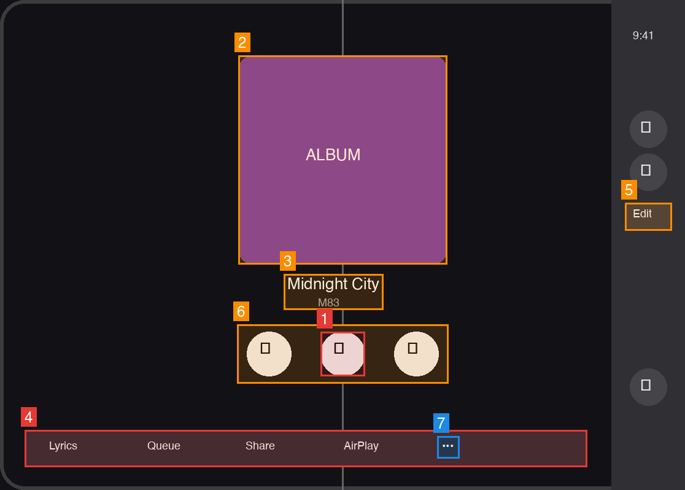

# Duo inspection — Now Playing   (mode B, pose: inner display, partially folded / book pose, landscape)



Geometry read off the image (1116×798): vertical bar on the **trailing** edge, x 996–1116 (10.7% of width, shaded grey); safe area x 0–996, centre x = 498; hinge line at x = 558 (grey vertical guide). The player column (artwork, labels, transport) is centred at x = 558 — the full-display centre, i.e. exactly on the hinge.

| # | Severity | Rule | Element | Problem | Fix |
|---|---|---|---|---|---|
| 1 | blocking | H2 | Play/Pause button (522,540 72×72) | Centred on the hinge line; the primary tap target sits on the curve, split between halves when folded | `ArrangementView(.split)` — transport in one pane, artwork in the other (snippet 1) |
| 2 | should-fix | H2 | Album artwork (388,90 340×340) | A third of the artwork sits on the fold and is distorted on the curve | Same split; artwork lives in one pane |
| 3 | should-fix | H2 | "Midnight City" / "M83" labels | Text centred on x=558 — the middle glyphs are on the fold and hard to read | Labels go with the artwork pane, or displace via `reservedRegions(kind: .division)` |
| 4 | blocking | F1 | Custom bottom bar: Lyrics · Queue · Share · AirPlay · … (40,700 916×60) | Hand-built horizontal row is still horizontal while the system has already gone vertical (round buttons + Edit on the trailing strip); it also spans the hinge | Declare these as `.toolbar` items so the system relocates them to the vertical bar (snippet 2) |
| 5 | should-fix | F3 | "Edit" in the vertical bar (1018,330 76×45) | Text-only item in the narrow strip — renders as a wide pill among symbol buttons, truncates when localised | `Label("Edit", systemImage: "pencil")` (symbol + title), or `.axisBehavior(.horizontalOnly)` (snippet 3) |
| 6 | should-fix | D4 | Player content column | Centred on full display width (558) instead of the safe area (498) — 60 px right of visual centre, and this centring is what puts #1–#3 on the hinge | Centre within the safe area; only the background should `.ignoresSafeArea()` (snippet 4) |
| 7 | nice-to-have | F7 | "…" in the custom bar | Own overflow item; once actions move to the system bar this becomes a second "more" menu. Could not confirm from the image whether it is a menu or a plain button | Drop it; let `ToolbarOverflowMenu` / `additionalOverflowItems` + `visibilityPriority` handle overflow |

No D1 finding: nothing interactive sits under the bar (the custom toolbar ends at x=956, bar starts at x=996).

## Fixes

### 1–3. Keep the player off the hinge — `ArrangementView(.split)`  (H2)
The three fold findings share one cause: a single centred `VStack`. Give the screen two panes and the system lays them out on either side of the division when folded (and side by side when open flat).

```swift
// before
VStack(spacing: 16) {
    Artwork(song)
    Text(song.title).font(.title2)
    Text(song.artist).foregroundStyle(.secondary)
    TransportControls(player)          // Play lands on x = 0.5
}

// after
ArrangementView(.split) {
    VStack(spacing: 8) {               // pane 1: glanceable
        Artwork(song)
        Text(song.title).font(.title2)
        Text(song.artist).foregroundStyle(.secondary)
    }
    TransportControls(player)          // pane 2: tappable, never on the division
}
```
If you'd rather keep one column, read the division and shift the control row off it:
```swift
let division = proxy.reservedRegions(kind: .division)   // from a layout/geometry proxy
// offset TransportControls toward whichever half has more room
```

### 4. Replace the custom bottom row with toolbar items  (F1)
```swift
// before
VStack {
    …player…
    HStack {                                           // custom, stays horizontal
        Button("Lyrics") {…}; Button("Queue") {…}
        Button("Share") {…};  Button("AirPlay") {…}
        Menu { … } label: { Image(systemName: "ellipsis") }
    }
    .background(.bar)
}

// after
…player…
.toolbar {
    ToolbarItemGroup(placement: .bottomBar) {
        Button { … } label: { Label("Lyrics",  systemImage: "quote.bubble") }
        Button { … } label: { Label("Queue",   systemImage: "list.bullet") }
        Button { … } label: { Label("Share",   systemImage: "square.and.arrow.up") }
        Button { … } label: { Label("AirPlay", systemImage: "airplayaudio") }
    }
}
```
The system moves the group into the vertical bar when the pose calls for it and overflows what doesn't fit (which is also the fix for #7 — delete the hand-rolled `…`; use `ToolbarOverflowMenu` / `additionalOverflowItems` and `visibilityPriority` if you need to control what overflows first).

### 5. "Edit" — give it a symbol  (F3)
```swift
// before
ToolbarItem { Button("Edit") { … } }

// after
ToolbarItem { Button { … } label: { Label("Edit", systemImage: "pencil") } }
// or, if the word must stay visible:
ToolbarItem { Button("Edit") { … } }.axisBehavior(.horizontalOnly)
```

### 6. Centre in the safe area, not the display  (D4)
```swift
// before
ZStack {
    background
    playerColumn
}
.ignoresSafeArea()                       // foreground inherits full-width centring
// or: .position(x: UIScreen.main.bounds.midX, …)

// after
ZStack {
    background.ignoresSafeArea()         // only the background goes edge to edge
    playerColumn                         // centred within the safe area (bar excluded)
}
```
Doing this alone moves the column's centre from x=558 to x=498 — off the hinge for this exact pose — but only the `ArrangementView` fix (#1–3) keeps it off the hinge in every pose.

## Not checked
- **I1 parity** — only one pose was supplied; can't confirm every action (Edit, the three round items, Lyrics/Queue/Share/AirPlay) survives the closed / outer-display pose. Send a closed-pose capture to check.
- **H5 laptop pose** — image is book pose; controls-on-bottom-half not evaluated.
- **G1 hierarchy** — no outer-display screenshot to compare against.
- Glyphs render as boxes in the fixture; the round shapes were treated as buttons (Play assumed to be the centre one). If the centre control is not Play, #1 still applies to whichever transport control it is.
