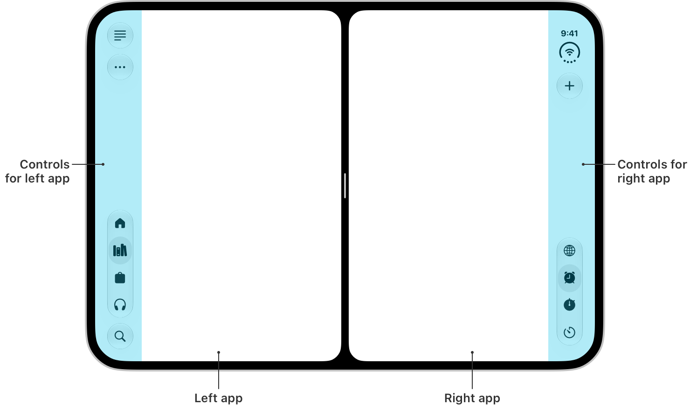

# iPhone Duo Design Guidelines

Rules for building and reviewing apps for iPhone Duo — Apple's folding, dual-display iPhone (iOS 27.1, September 2026). Distilled from Apple's HIG page *Designing for iPhone Duo* and the six iPhone Duo tech talks. Every API named here appears in Apple's own code samples or documentation; every React Native API is a shipping package. Nothing is inferred.

Apply these while writing code, or review files against them. Output terse `file:line — rule — fix` findings; high signal, no padding.

## The device in five lines

- **Outer display** (closed): wider and shorter than any other iPhone. Horizontal size class **compact**. Toolbars, tab bar, status bar and Dynamic Island move to a **vertical strip on the side**.
- **Inner display** (open): largest iPhone display, a **hinge** through the center. Size classes **regular × regular**. Vertical strip in landscape; normal horizontal bars in portrait.
- **Poses**: closed · open flat · partially folded like a book · laptop (on a table, screen facing you) · tent · standing. Don't design per pose — design to resize.
- **Split View multitasking**: two apps side by side (50/50) on the inner display. Each app's vertical strip is on its *outer* edge — so it can be on the **left**.
- **Reserved regions**: outer camera (always), inner camera (only while active), the fold (only while partially folded). Content avoids them; system components do it automatically.


## If you do only one thing: make the app resize

iPhone Duo doesn't need a new kind of layout. It needs the same resizable layout that already breaks on iPad Split View, Stage Manager and iPhone Mirroring. Get these right and most of the Duo rules below fall out for free.

| Rule | Swift | React Native |
|---|---|---|
| Decide layout from available width, never from device model | `horizontalSizeClass` | `useWindowDimensions().width` |
| Never from orientation | no `interfaceOrientation` / `UIDevice.current.orientation` | no `expo-screen-orientation` state; no `app.json` orientation assumptions |
| Never from idiom | no `userInterfaceIdiom == .pad` | no `Platform.isPad` |
| No cached screen size | no `UIScreen.main.bounds` | no `Dimensions.get('window')` at module scope |
| No fixed widths or breakpoints tied to a device | no `.frame(width: 390)` | no `width: 390`, no `SCREEN_W` constants |
| Read each safe-area side separately | `bounds.inset(by: safeAreaInsets)` | `insets.left`, `insets.right` (not `paddingHorizontal: insets.left`) |
| Foreground inside the safe area, background may extend past it | SwiftUI default / `.ignoresSafeArea()` for art | `SafeAreaView` + `edges` / full-bleed image behind it |
| Let system containers do the work | `NavigationSplitView`, `TabView`, sheets, alerts | `native-stack`, `createNativeBottomTabNavigator` / Expo `NativeTabs`, `Modal pageSheet`, `Alert` |
| Test at half width and in landscape before shipping | Split View, iPhone Mirroring | same |

Everything below is what Duo adds on top.

## Rules

### Layout foundations

- Drive layout from **size classes** (Swift) or **window width** (RN) — never from device model, idiom, or orientation.
  Swift: `@Environment(\.horizontalSizeClass)` / `traitCollection.horizontalSizeClass`. RN: `useWindowDimensions()`.
- The inner display **ignores your supported orientations**. Orientation-gated layout silently breaks there.
  Swift: no `interfaceOrientation` / `UIDevice.current.orientation` for layout. RN: no `expo-screen-orientation` state for layout; `app.json` `"orientation": "portrait"` doesn't hold when open.
- `.phone` idiom is **regular/regular** on the inner display. Never `userInterfaceIdiom == .pad` / `Platform.isPad` to decide "wide layout".
- No **fixed widths**, breakpoints tied to a device, or cached screen size. The app resizes on open/close, in Split View (half width), with Picture in Picture pinned (shrinks vertically, live), and under iPhone Mirroring.
  Swift: no `.frame(width: 390)`, no `UIScreen.main.bounds`. RN: no `Dimensions.get('window')` at module scope — it's stale after a fold; use `useWindowDimensions()` inside the component.
- **`UIScreen.main` is ambiguous** on a two-display device and will be deprecated. Swift: `window?.windowScene?.screen`, `traitCollection.displayScale`. RN: `PixelRatio.get()` / `useWindowDimensions().scale`.
- `UIRequiresFullScreen` is honored but the app **still resizes** on open/close and scales in Split View. It's not an exemption.
- Corners: use the iOS 26 concentricity APIs, updated for Duo's screen shape — `ConcentricRectangle` (SwiftUI) / `UICornerConfiguration` (UIKit). RN: no binding; avoid hand-drawn full-screen rounded corners.
- Games: lock orientation if you must, but **fill the screen in every pose**. Prefer aspect-ratio change over letterboxing; put artwork in any unavoidable padding.

### Safe areas — they are asymmetric now

- The vertical strip is a **leading or trailing safe-area inset**. Horizontal bars → top/bottom insets; vertical bars → left/right insets. Which side depends on Split View position and is the same physical side in RTL.
- **Foreground / interactive content inside the safe area.** Swift: SwiftUI default; UIKit `safeAreaLayoutGuide` or `bounds.inset(by: safeAreaInsets)`. RN: `SafeAreaView` from `react-native-safe-area-context` (with `edges`), or `useSafeAreaInsets()` as padding.
- **Background art may extend past it.** Swift `.ignoresSafeArea()` / `view.bounds`. RN: full-bleed image under a `SafeAreaView`-wrapped foreground.
- **Never mirror one side's inset onto the other.** Swift: `bounds.inset(by: safeAreaInsets).width`, not `width - insets.left * 2`. RN: `paddingLeft: insets.left, paddingRight: insets.right` — not `paddingHorizontal: insets.left`.
- Layout margins are asymmetric too. Use the system margins; don't add your own constant.
- **Centering on the full display is the exception.** Most content should be offset by the safe area so it isn't behind controls. Full-width centering is only for immersive, non-scrolling visuals with nothing tappable under the strip (Calculator). Mixed is fine: full-width header image, inset scrolling foreground.
- Test with the app on **both sides** of Split View — the strip flips.


### The fold

- **Use system components** wherever you can — sheets, alerts, action sheets, menus, popovers, context menus, toolbar buttons, `NavigationSplitView` / `UISplitViewController` all avoid the fold automatically (split views snap to an even 50/50).
  RN: `Modal` with `presentationStyle: 'pageSheet'` / `'formSheet'` and `Alert` are native and avoid the fold. **JS-drawn bottom sheets, custom modals and toasts don't.**
- **No interactive element on the hinge line** when partially folded. Buttons that land on the curve are hard to tap; text and images that cross it are hard to read.
- Custom, manually positioned controls that must dodge the fold use the reserved-region API — Swift only, iOS 27.1:
  `proxy.reservedRegions(kind: .division)` on a `GeometryProxy` · `view.reservedRegions(kind: .division)` on `UIView` · each region has a `frame` · `.occlusion` = the inner camera · `options: .includeInactive` returns the fold even when flat (zero width).
  RN: **no JS binding yet.** Structure the layout so it doesn't need one (two panes, even columns, system containers), or write a native module.
- **Displace minimally.** Move only what's necessary; related elements move together; nothing disappears. Scrolling content (feeds, articles, lists) doesn't displace — it already adapts by scrolling.
- Where things go: **book pose** → trailing region (closer to where it'll be when closed). **Laptop pose** → glanceable content on top, tappable controls on the stable bottom half.
- **Grids: even number of columns** so the fold lands on a gutter. Swift: decide with `.includeInactive` so it doesn't reflow mid-fold. RN: pick column count from `useWindowDimensions().width` and prefer even counts at inner-display widths.
- Centered hero layouts are the most common thing to straddle the hinge on the inner display. Audit every full-width-centered view.

### Two-pane layouts

- **Same hierarchy on both displays** — the inner display shows one more level of it, not a different app. Mail: list *or* message closed; both open.
- Navigation hierarchy → `NavigationSplitView` / `UISplitViewController` (collapses closed, columns open, fold-aware). RN: `@react-navigation/native-stack` is a real `UINavigationController`; there's no native split-view navigator — build the two-pane inner-display layout in JS from window width and keep it the same hierarchy.
- Tab-based apps may promote the tab bar to a sidebar on the inner display (dense apps like Health, not everyone): `.defaultTabBarPlacement(.sidebar)` / `tabBarController.sidebar.preferredPlacement = .sidebar`.
- **Arrangement views** (iOS 27.1, Swift only) for layouts that *look* like a split view but aren't navigation — player + queue, content + control panel:
  `ArrangementView { Primary() } secondary: { Secondary() }` inside a `NavigationStack` · `.arrangementViewStyle(.split)` (default; horizontal when wider than tall, vertical when taller) · `.split.axes(.horizontal)` to restrict · `.arrangementViewStyle(.overlay)` (layers; goes side-by-side when folded) · `@Environment(\.overlayArrangementZIndex)` (> 0 = stacked, collapse; 0 = own region, expand).
  UIKit: `UIArrangementViewController`, `.setViewController(_:for: .primary/.secondary)`, `.updateArrangement(.split.axes(.horizontal))`, `.state(for: .primary)?.zIndex`.
- `HStack`/`VStack` two-pane → `.split`. `ZStack` overlay → `.overlay`. Split when neither view may be obscured (main/detail); overlay when there's a foreground/background relationship.
- **Never** put `NavigationStack` / `NavigationSplitView` / `TabView` *inside* an `ArrangementView` — wrap the arrangement in them. **Never** put an `ArrangementView` inside `List` / `ScrollView`.
- RN: no `ArrangementView` binding. A `flexDirection: width > height ? 'row' : 'column'` container with even halves gets you the split behavior; a native module gets you fold awareness.


### Toolbars, tab bars, and the vertical strip


- **Only system-managed bars move to the strip.** Swift: `.toolbar {}` inside `NavigationStack` / `NavigationSplitView` / `TabView`; UIKit `navigationItem` groups under `UINavigationController` / `UITabBarController`. Hand-built `UIToolbar` / `UINavigationBar` / `UITabBar` content is **not considered**.
  RN: `@react-navigation/native-stack` headers are native → participate. **JS-drawn tabs (`createBottomTabNavigator`) stay at the bottom.** Use native tabs to get a real `UITabBarController`: React Navigation's `createNativeBottomTabNavigator` (from `@react-navigation/bottom-tabs/unstable` in v7; the default in v8), Expo Router `NativeTabs`, or `react-native-bottom-tabs`. JS-drawn headers (`@react-navigation/stack`) won't move.
- **Order, top to bottom:** Back/Close → prominent action (Done, Save) → grouped toolbar items → tab bar. Swift: `ToolbarItem(placement: .cancellationAction)`, then `.topBarPinnedTrailing` / UIKit `navigationItem.pinnedTrailingGroup`. RN native-stack: the back button is automatic; `headerRight` maps to the trailing group.
- **Symbols go vertical; text stays horizontal.** The strip has fixed width, flexible height. Give every symbol item a **title too** (used in overflow/expanded forms): `Label("Share", systemImage:)` / `UIBarButtonItem(title:image:…)`. RN native-stack `headerRight` renders a custom view → treated as custom (stays horizontal); prefer symbol-only content and keep it narrow.
- Minimize text-only items. Counts become **badges**: `.badge(7)` / `item.badge = .count(7)`. Text that carries information ("$42") stays horizontal; text that only reinforces a symbol goes.
- Items that swap symbol⇄text (custom Select/Done) → `.axisBehavior(.horizontalOnly)` / `item.axisBehavior = .horizontalOnly`. The system Edit button already does this.
- Custom views that *do* fit the strip opt in: `.axisBehavior(.verticalPreferred)`; read `@Environment(\.toolbarVerticalEdge)` / `traitCollection.verticalBarEdge` to render the vertical variant (nil / unspecified = not vertical).
- No manual spacing. Flexible spacers are zero-size vertically. Group with `ToolbarItemGroup` / `UIBarButtonItemGroup`.
- Controls stay **near what they control** — leading-pane controls stay above that pane (Mail's list actions), not in the strip.
- **One overflow menu**, the system's: `ToolbarOverflowMenu { … }` / `navigationItem.additionalOverflowItems = UIDeferredMenuElement { … }`. Ellipsis symbol is reserved for it; other menus get a distinct symbol.
- Items overflow **bottom to top**. Set `.visibilityPriority(.high / .low)` / `item.visibilityPriority` — groups first, then items — so Compose/New and badged items survive longest.
- Which bar compresses first: default = toolbar (keeps tab destinations). Task-focused screens flip it: `.toolbarVerticalCompressionBehavior(.prefersToolbarItems)` / `navigationItem.verticalBarCompressionBehavior = .prefersBarItems`.
- Disable the strip only for a single-page bottom-heavy layout (Calculator) or a one-button sheet: `.toolbarVerticalBehavior(.disabled)` / `override var preferredVerticalBarBehavior: UIVerticalBarBehavior { .disabled }`.
- Split views: only the **detail column** gets a strip. Sheets: strip on the outer display; centered with horizontal bars on the inner. Keyboard accessory bars never move.
- **Consistency across poses**: not every pose has a strip, so keep each control's relative position the same — people shouldn't relearn where Done is.

### Poses, multitasking, scenes

- Same functionality and controls in every pose. An optional laptop-pose layout is fine if it keeps the full control set.
- Support landscape on the outer display where reasonable — tent pose is a real use case.
- All apps get Split View multitasking; no opt-in. Just resize correctly.
- Multi-scene apps: new windows can be created only on the **inner** display. Handle scene-request errors; `UIWindowSceneActivationAction` hides itself when unavailable.
- Hinge angle is for **effects and interactions**, not layout: `.onHingeChange { _, ctx in if let h = ctx.hinge, h.status == .partiallyOpen { … h.angle … } else { reset } }` (`hinge` is nil on non-folding devices; status: `.closed / .partiallyOpen / .fullyOpen`). UIKit: `UIHingeInteraction`. RN: no binding.
- Camera apps: the Virtual Front Camera auto-switches inner/outer; explicit `.builtInInnerUltraWideCamera` / `.builtInOuterUltraWideCamera` + `AVCaptureDeviceDirectionCoordinator` for full control; `CameraCaptureAccessory` shows UI on the outer display while capturing on the inner. RN: `expo-camera` / `react-native-vision-camera` use the virtual camera by default — that's fine.



## Build and test

- Vertical bars and edge-to-edge layout require building with the **iOS 27.1 SDK (Xcode 27.1)**. Older builds run, but bars stay horizontal and the app doesn't extend under the strip. RN: same — it's the native build that matters; Expo needs an EAS/Xcode 27.1 build.
- Simulate: Xcode 27.1 → **Device Hub** → iPhone Duo. Buttons at the bottom open / close / rotate / fold. Split View: drag the app by its home indicator to a side, then the other side.
- Poses to check: closed portrait · closed landscape · open portrait · open landscape · book fold · Split View left · Split View right · PiP pinned.
- Xcode 27.1 ships Apple's own **App Resizability** skill (SwiftUI + Duo). Use it as a second opinion.

## Do NOT use — these don't exist

Agents invent these. If you see one in code or are about to write one, stop.

`FoldableView` · `HingeView` · `DualScreenView` · `foldState` · `isFolded` · `foldingRegion` · `hingeAngle` (it's `hinge.angle`) · `UIFold*` · `devicePosture` · `UITraitCollection.usesVerticalBars` · `verticalToolbar` · `toolbarAxis` · `.toolbarPlacement(.vertical)` · `preferredAxis` · `reservedRegion(` (singular) · `safeAreaRegions` · `.arrangementStyle(` (it's `.arrangementViewStyle(`) · `SplitArrangementView` · a 24-pt "hinge gutter" constant · a 640-pt "unfolded" breakpoint · any RN package named `react-native-fold*` / `expo-hinge*` / `react-native-duo*` (none exist as of September 2026).

Verified symbol list with sources: `research/VERIFIED-APIS.md` in the repo.

## Output format

For code:
```
path/File.swift:42 — fixed width 390 on root view — remove; let the safe area size it
path/File.swift:9 — UIToolbar() hand-built — move items to navigationItem so they go vertical
src/Player.tsx:17 — Dimensions.get('window') at module scope — useWindowDimensions() inside component
```
For a screenshot: `[where on screen] — rule — fix`, e.g. `[center, on the hinge] — Play button straddles the fold — ArrangementView(.split) player | queue`.
Group by severity: **blocking** (hidden/unreachable/crash on open, close, fold, split) → **should fix** → **nice to have**. If a file is clean, say so in one line.

## Sources

HIG: https://developer.apple.com/design/human-interface-guidelines/designing-for-iphone-duo · Tech talks 111461 Prepare your app · 111462 Raise the bar · 111463 Strike a pose · 111464 Multiple displays and scenes · 111465 Camera · 111466 Design for iPhone Duo (https://developer.apple.com/videos/play/tech-talks/<id>).
